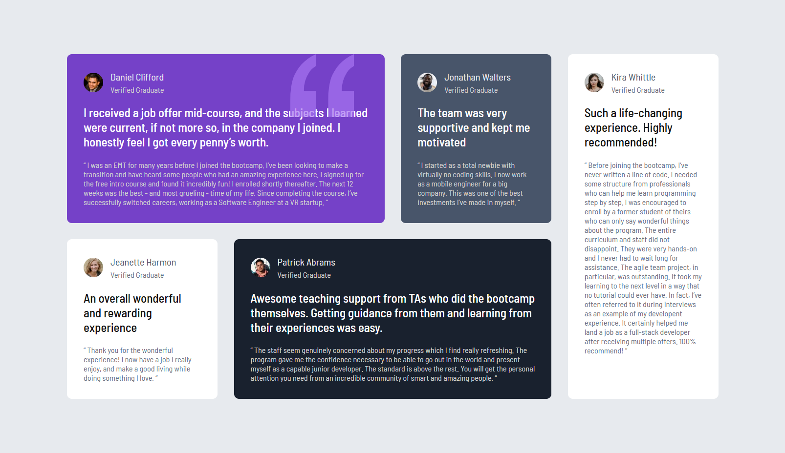

# Frontend Mentor - Testimonials grid section solution

This is a solution to the [Testimonials grid section challenge on Frontend Mentor](https://www.frontendmentor.io/challenges/testimonials-grid-section-Nnw6J7Un7). Frontend Mentor challenges help you improve your coding skills by building realistic projects.

## Table of contents

- [Overview](#overview)
  - [The challenge](#the-challenge)
  - [Screenshot](#screenshot)
  - [Links](#links)
- [My process](#my-process)
  - [Built with](#built-with)
  - [What I learned](#what-i-learned)
- [Author](#author)
- [Acknowledgments](#acknowledgments)

## Overview

### The challenge

This is my 7th project and also I built with grid again. I feel like I get used to using grid.

### Screenshot



### Links

- Solution URL: [Solution URL here](https://github.com/MgMyatHtayKhant/testimonials-grid-section-main)
- Live Site URL: [Live site URL here](https://frontend-testimonials-grid.netlify.app/)

## My process

### Built with

- Semantic HTML5 markup
- CSS custom properties
- Flexbox
- CSS Grid
- Mobile-first workflow

### What I learned

In this project I learned about grid-template-columns property. It's one of grid property.

```css
@media only screen and (min-width: 768px) {
  .container {
    grid-template-columns: repeat(2, 1fr);
    grid-template-areas:
      "t-1 t-4"
      "t-2 t-3"
      "t-5 t-5";
  }

  .testimonial-1 {
    grid-area: t-1;
  }

  .testimonial-2 {
    grid-area: t-2;
  }

  .testimonial-3 {
    grid-area: t-3;
  }

  .testimonial-4 {
    grid-area: t-4;
  }

  .testimonial-5 {
    grid-area: t-5;
  }
}
```

## Author

- Website - [Saul](https://saul-homepage.netlify.app/)
- Frontend Mentor - [@Saul](https://www.frontendmentor.io/profile/MgMyatHtayKhant)

## Acknowledgments

This project is done by myslef and I'm proud of it.
